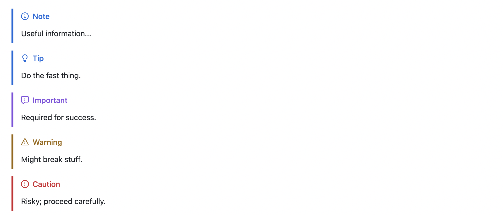

# 🔀 Learn Git

To work effectively with GitHub, you need to understand **Git**—the version control system behind it.

Git is what allows us to:

- Track every change to the codebase
- Collaborate without overwriting each other’s work
- Revert mistakes and debug issues
- Review progress over time

Think of Git as the **“undo + time machine + multiplayer mode”** of software and data projects. Even if you’re not writing code every day, knowing Git helps you work smarter, stay organized, and communicate clearly with your team.

---

## 📚 Learn the fundamentals of git:

### 👉 For Data and Cyber

[Net Ninja's Git Tutorial](https://www.youtube.com/playlist?list=PL4cUxeGkcC9goXbgTDQ0n_4TBzOO0ocPR)

It’s interactive, beginner-safe, and will give you exactly what you need to be confident working in GitHub. Take it seriously—this is a **must-have skill** in today’s tech world.

### 👉 For Software Engineers

[Boot.Dev's Learn Git 2 Course](https://www.boot.dev/courses/learn-git-2)

You don't have to finish all of it, you will during the first week of the onboarding).

This course is **completely free** and does **not require any tracking or payments**. Just make sure to select the **free tier**, which gives you full access to everything you need for onboarding and beyond—no upgrades necessary.

This is quite advanced material, but you already learned git 😄. If you need to, you can later revise the `Learn Git` (1) course. Or better, if you are stuck during this more advanced course, ask for your Team Lead's help!

---

## Markdown

Markdown makes your GitHub issues easy to read and act on. Headings show the problem at a glance, lists make steps and findings unambiguous, quotes capture context, and code blocks preserve logs and commands exactly. Clear formatting helps teammates reproduce bugs faster, prevents back-and-forth, improves searchability, and shows you can communicate like a professional engineer.

Headings

```
# Title (H1)
## Section (H2)
### Subsection (H3)
```

Emphasis

```
**bold**   *italic*   ~~strikethrough~~
```

Lists

```
- bullet item
- another
  - nested

1. ordered item
2. another
```

Task lists (checkboxes)

```
- [ ] todo
- [x] done
```

Quotes (for highlighting notes or referencing comments)

```
> This is a quote or callout.
```

Code (use for commands, errors, or snippets)

````
Inline: `npm run dev`

Block:
```bash
git fetch && git checkout feature/login
````

Links and images

```

[link text](https://example.com)


```

Horizontal rule (separate sections) (---)

```
---

```

You can also create beautiful alerts, syntax (must be in a blockquote (```):

GitHub supports five admonitions (“alerts”):

- [!NOTE]
- [!TIP]
- [!IMPORTANT]
- [!WARNING]
- [!CAUTION]

Where it works: READMEs and other repo Markdown, Issues, PRs, Discussions, Wikis (GitHub renderer). It’s a GitHub extension to GFM—not portable to all Markdown engines.



### Full Markdown Tutorial

<a href="https://www.youtube.com/watch?v=_PPWWRV6gbA&t" target="_blank" rel="noopener noreferrer">The Only Markdown Crash Course You Will Ever Need</a>

---

## 🔭 Next Steps

After you go through the git tutorial, you have officially finished Day #1 at webeet.io, congraz! 🎉

Nothing else to do.

Your lead will invite you to the opening session of day #2 where you will start diving deeper into the technical aspects of your domain. All you need to do after finished the git tutorial (above) is to show up for day #2.

Welcome to the team, and we will see you on day #2 ⚡️
