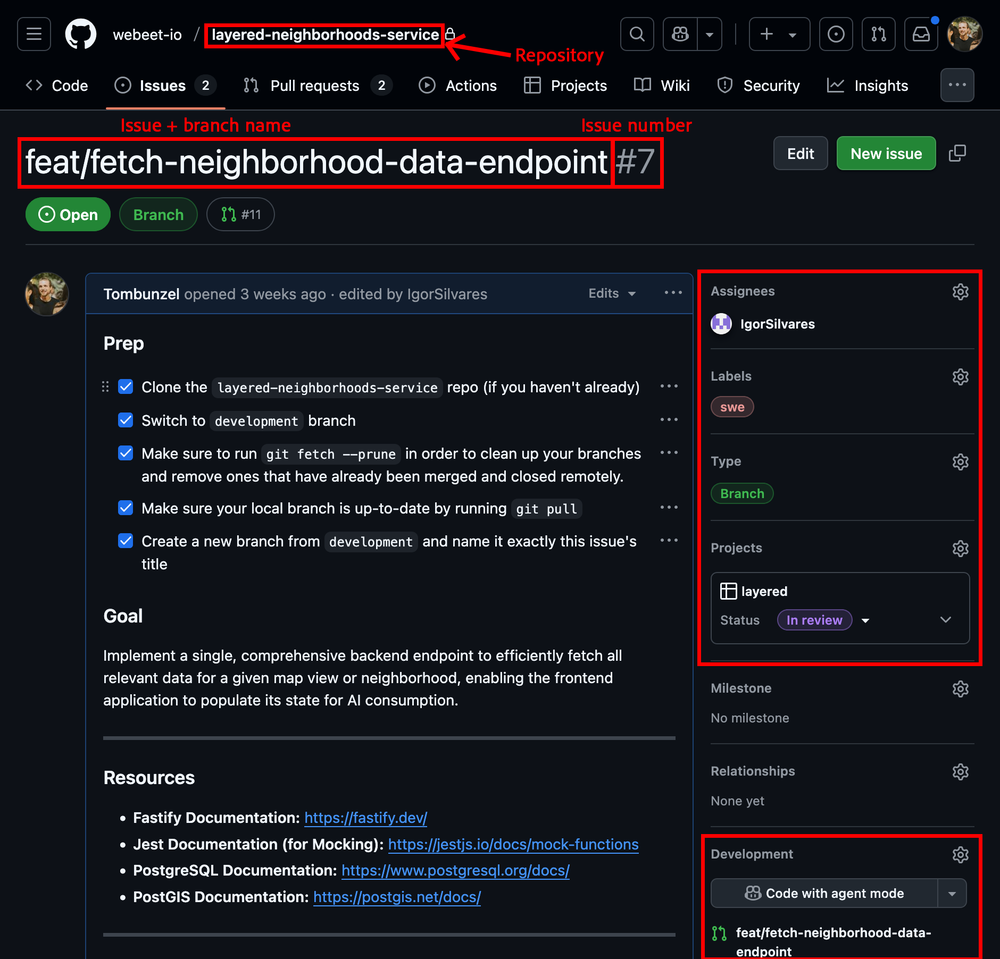
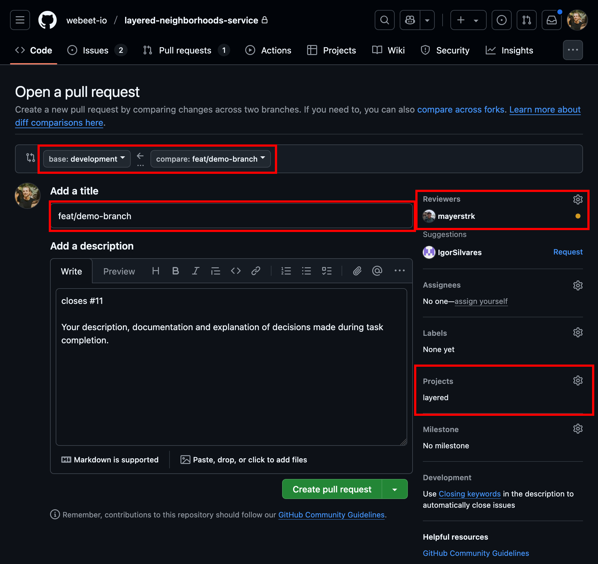

GitHub is our central hub for project management and collaboration. It's where we track our work, review code, and manage the entire lifecycle of a feature from idea to deployment. This guide explains our issue hierarchy and the specific workflow you'll follow when contributing to the **Layered** platform.

---

### Our Issue Hierarchy: From EPIC to Branch

Our work is organized across different repositories to keep things clean. You'll primarily interact with two types of issue locations:

1.  **The PRD Repository (`_layered-documentation`)**: This is our "single source of truth" for what we're building. It contains high-level issues that define the product. You may **read** these issues for context, but you won't typically be assigned to them directly.

    - **EPIC**: A large-scale feature or goal, like setting up a whole data pipeline. It's a container for multiple Features and Chores.
      <details>
      <summary>Example EPIC</summary>

      [EPIC 2: Data Foundation & Frontend Context #20](https://github.com/orgs/webeet-io/projects/2/views/10?pane=issue&itemId=117388615&issue=webeet-io%7C_layered-documentation%7C20)

      This epic represents a critical, foundational data slice... it prepares the application by loading all necessary data into the client, making it available as a rich context for the AI chat...

      </details>

    - **Feature**: A specific user-facing story that delivers value. It has a user story and acceptance criteria from a product perspective.
      <details>
      <summary>Example Feature</summary>

      [Feature: Create API Endpoint for a Neighbohood's Data Context #26](https://github.com/orgs/webeet-io/projects/2/views/10?pane=issue&itemId=117439965&issue=webeet-io%7C_layered-documentation%7C26)

      As a frontend developer, I need a single, comprehensive endpoint to fetch all relevant data for a given map view, so I can efficiently populate the application's state for the AI to use.

      </details>

    - **Chore**: A necessary technical task that supports a feature but isn't a feature itself (e.g., setting up a database schema).
      <details>
      <summary>Example Chore</summary>

      [Chore: Define Initial Data Schema & Set Up Ingestion DB #13](https://github.com/orgs/webeet-io/projects/2/views/10?pane=issue&itemId=117393744&issue=webeet-io%7C_layered-documentation%7C13)

      As a Data Analyst, I need a well-defined database schema and a dedicated database environment for raw data ingestion...

      </details>

2.  **The Service Repositories (`layered-web-client`, `layered-auth-service`, etc.)**: These are the actual codebases where you'll do your work. The issues here are concrete, technical tasks.

    - **Branch Issue**: **This is the issue you will be assigned.** It's a developer-focused task broken down from a high-level `Feature` or `Chore`. It contains precise technical acceptance criteria. **The title of this issue is critically important**, as it will always be named exactly the same as the branch you will work on. Read more on our naming convention on the Naming Convention resource page.

      <details>
      <summary>Example Branch Issue</summary>

      [feat/fetch-neighborhood-data-endpoint](https://github.com/webeet-io/layered-neighborhoods-service/issues/7)

      **Goal:** Implement a single, comprehensive backend endpoint to efficiently fetch all relevant data for a given map view or neighborhood...

      </details>

---

### Your Day-to-Day Workflow: From Issue to Merged PR ✅

This is the exact process to follow when you are assigned a task.

#### 1. Start with Your Assigned Issue

You will be assigned a **Branch Issue** in one of our service repositories (e.g., an issue in `layered-neighborhoods-service`). This is your starting point.

- Read the goal and acceptance criteria carefully.
- Note the **exact title** of the issue. This is your branch name.



:::tip

- Notice where it says the repository this issue is in.
- The info panel on the right shows the assignee, labels, type of issue and the project this issue belongs to.
- Under the Development section you can see the PR this issue is connected to.
  :::

#### 2. Create Your Branch

Follow the Git workflow to create your branch. It must be named **exactly** the same as your assigned Branch Issue title.

```bash
# Example from the Branch Issue above:
# The issue title is "feat/fetch-neighborhood-data-endpoint"

# In your local clone of the layered-neighborhoods-service repo:
# Switch to the branch you wish to branch from, in our example: development
git switch development
# Pull the most recent changes
git pull
# Use switch with the c flag to create and switch to a new branch
git switch -c feat/fetch-neighborhood-data-endpoint
```

#### 3. Code, Commit, and Push

Do the work to meet the acceptance criteria. Remember to make small, frequent commits using [Conventional Commits](/resources/conventional-commits) standard. Once your work is complete, push your branch to its remote counterpart on GitHub.

```bash
git push -u origin feat/fetch-neighborhood-data-endpoint
```

#### 4. Create the Pull Request (PR)

On GitHub, you'll see a prompt to create a Pull Request for your newly pushed branch.


1. **Verify the Base Branch**: Make sure that the base branch displayed above the issue's title is the correct branch you were instructed to branch out from, and are therefore supposed to merge your work back into. [see screenshot provided below]

2. **Set the PR Title**: The title of your PR must be **exactly the same** as the branch name and the Branch Issue title. This consistency is crucial for our automation and tracking.

3. **Link the Issue**: In the PR description box, type a keyword followed by the issue number of your **Branch Issue**.

   - Keywords: `Closes`, `Fixes`, `Resolves`
   - **Example**: `Closes #7`

   Doing this will automatically link your PR to the issue. You will see the link appear in the "Development" section on the issue page. This tells the team that your PR will complete the work for that issue.

4. **Add a description to your PR**: Document your work, the functionality of your feature and any decisions you made in the process in the PR's description.

5. **Submit the PR**: Fill out any other details in the PR template, assign your Team Lead as a reviewer and click "Create pull request". Your Team Lead will be automatically notified to review your work.

   

### That's it! You've successfully navigated the core Webeet development workflow on GitHub.
